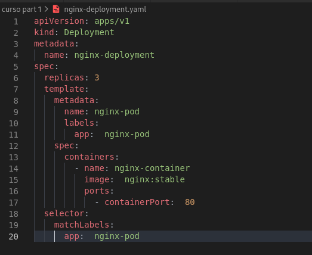

# Deployments
***
## O que são?
***
* Deployments nada mais são que uma camada acima dos ReplicaSets, então quando definimos um deployment estamos automaticamente definindo um replicaset.
* O que muda do ReplicaSet para o deployment é que ele permite o controle de versionamento das imagens e dos pods
* Usando o comando `kubectl rollout history deployment <Nome do deployment>` irá aparecer o historico de mudanças feitas nesses pods
* A cada mudança/alteração usa-se a flag --record para iniciar o deployment EX: `kubectl apply -f <Arquivo.yaml> --record`
* Assim como no git é possivel escrever uma mensagem a cada mudança realizada dentro dos pods, usa-se o comando:
* `kubectl annotate deployment <Nome do deployment> kubernets.io/change-cause="Mensagem sobre a mudança"`
* Caso você queira voltar para versão especifica que foi usada antes é possível usando o comando:
* `kubectl rollout undo deployment <Nome do deployment> --to-revision=<Nº da revision que você quer voltar> `
* Ajuda no controle de atualização para os Pods e ainda tem os beneficios do replicaset
* É recomendado utilizar o deployment ao invés do replicaset como uma boa pratica.
* EX:
