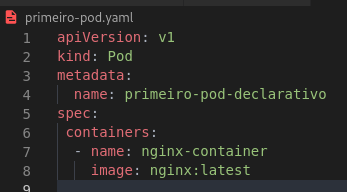

# :hammer_and_pick: Pods
***
### :gear: O que são e como funcionam?
***
##### O que são
* Os pods podem ser comparados como containers no "mundo docker".
* O pod é uma "capsula", ou seja, dentro de um pod podem existir 1 ou mais containers.
* Os pods são efêmeros então eles podem deixar de existir a qualquer momento, sendo assim o kubernets tem total liberdade para criar um novo pod, não necessariamente com o mesmo ip, caso um pod deixe de existir.
* Pode acontecer de um container acabar morrendo dentro de um pod e caso ainda tenha um container "saudável" dentro dele ele continuará funcionando, mas caso não exista mais nenhum container funcionando dentro do Pod ele irá ser derrubado e outro será criado dentro dele.
##### Comunicação entre os Pods e Containers
* A comunicação do kubectl com um pod é feita por uma **Api** podendo essa comunicação ser feita de maneira declarativa ou imperativa.
* Os pods possuem um endereço ip relacionado ao Pod e não ao container, os containers vão ser referenciados pela porta ex: IP:8080.
* Os container irão compartilhar o mesmo namespace de rede e IPC, podendo compartilhar volumes.
* E um pod comunicar diretamente com outro Pod.
***
### Criando um Pod e utilizando comandos
***
##### Criando e inpecionando um Pod
* Use o comando ```kubectl run <nome> --image=<image>```  assim você irá criar um pod
* Para ver se o pod foi iniciado utiliza-se o comando ```kubectl get pods``` para listar os pods ativos, parecido com o docker ps
* Utilize a flag ```--watch``` para acompanhar em tempo real os pods
* Para inspecionar um pod utilize o comando ```kubectl describe pod <Nome do pod>```
##### Editando um Pod
* Para editar um Pod, ou seja, caso queira atualizar ou remover algo utilize o comando ```kubectl edit <Nome do Pod>```
* Usando o comando anterior, ele irá abrir um bloco de notas para que você consiga alterar.
***
### Criando um Pod de maneira declarativa
***
* A criação de um Pod de maneira declarativa pode ocorrer de duas maneira, ou por um arquivo do tipo JSON ou por um arquivo do tipo Yaml.
* Dentro dele precisamos especificar a versão da API com a tag ```apiVersion: <versão>```, geralmente usa-se a versão estável.
* Precisamos especificar também o tipo com a tag ```kind: Pod```, ele pode ou ter um metadata como o name, sendo especificado com a tag ```metadata: ```, além disso ele precisa especificar as imagens e os nomes dos containers, caso exista mais de um. 
***
#### Exemplo de um arquivo yaml:

* Utilize o comando ```minikube start``` antes para a criação da VM caso não tenha feito.
* Após a criação do arquivo yaml, utilize o comando ```kubectl apply -f <arquivo.yaml>```
* Caso tudo ocorra certo aparecerá uma mensagem no console informando que o pod/arquivo foi criado
##### Algo semelhante a isso:

* Utilize o comando ```kubectl get pods``` para verificar o estado do Pod


