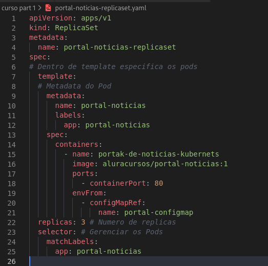

# ReplicaSet
***
## O que são?
***
* **ReplicaSet** é um resource do Kubernets que tem a capacidade de encapsular um ou mais pods e também gerenciá-los, além disso caso um pod venha a falhar, automaticamente o replicaset irá criar um outro pod em seu lugar.
* O ReplicaSet irá irá manter sempre a quantidade de pods desejados, criando e excluindo eles.
* Quando um ReplicaSet precisa criar novos pods, ele usa seu modelo de pod.
* Todos os Pods adquiridos por um ReplicaSet têm as informações de identificação de seu próprio ReplicaSet no campo ownerReferences. 
* Ex: de um ReplicaSet

