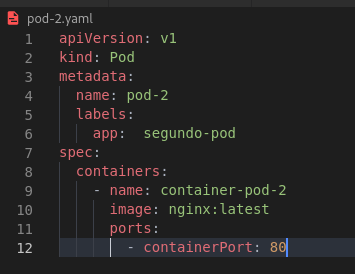
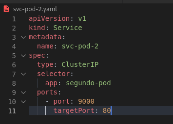
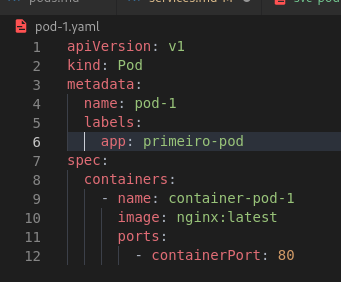
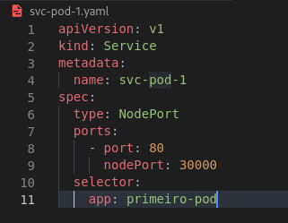
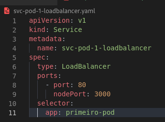

# Services 
***
## O que é e como Funciona?
***
### O que são?
* Services é um resource do kubernets que permite a comunicação de diferentes aplicações e de diferentes pods.
* Os Services proveem IP's fixo para comunicação.
* Proveem um DNS para um ou mais pods.
* São capazes de fazer balanceamento de cargas
* Os services por mais que associados a pods, caso um pod deixe de existir, o service continuará funcionando.
* É necessário dentro dos pods existir uma lable dentro de metadata que especifique o app, para que assim o service entenda quais pod ele deve atuar.
* Dentro do arquivo .yaml é necessário especificar o type, o kind, o selector, que deve ser qual pod ele atuará de acordo com a label passada e a porta que ele irá ouvir e a porta que ele ira despachar com a tag ```targetPort```.

#### Os services possuem 3 tipos:
##### ClusterIP
##### NodePort
##### LoadBalancer
***
### ClusterIP
* O service ClusterIP serve para fazer a comunicação entre diferentes pods dentro de um mesmo cluster.
* Comunicação **apenas internamente**, ou seja, dentro do Cluster.
##### Exemplos de pod e svc
  
***
### NodePort
* Tipo de serviço que permite a comunicação com o mundo externo, comunicação com máquinas de fora do cluster.
* Também funciona como um ClusterIP, realizando a comunicação dentro do cluster.
* É possivel definir uma porta externa atráves da tag ```nodePort: ```, **As portas devem estar no intervalo entre 30000-32767**
##### Exemplos de pod e svc
  
***
### LoadBalancer
* O load balancer é um tipo de ClusterIP que permite a comunicação entre uma máquina do mundo externo e os nossos pods, só que automaticamente se integra ao load balancer do cloud provider.
###### Exemplo de LoadBalancer:
  
