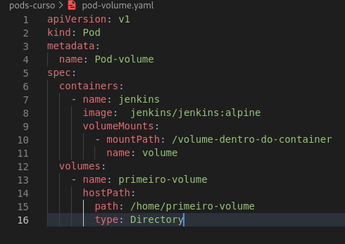
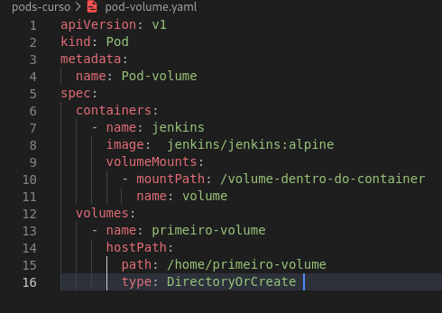

# Volumes
***
## O que são:
***
* Os volumes por sua natureza também são efêmeros e portanto possuem o tempo de vida de um Pod, o ciclo de vida de um volume é independente de um container, mas dependente de um Pod.
* Os volumes são uma maneira de persistir informações dentro de um pod, eles são totalmente dependentes dos pods e caso o Pod que continha o volumes morra, o volume também deixará de existir.
* Porém existem volumes que não dependem da existência de um Pods, eles são chamados de Persistents Volumes
* Um Pod pode ter diferentes tipos de volume simultaneamente.
* Eles são declarados dentro do campo spec do Pod.
***
### HostPath
***
* Esse tipo de volume ao ser declarado no Pod, ele cria um diretório dentro do container, e esse diretório é mapeado para um diretório dentro da máquina que está executando o Pod.
* Esse volume deixa de existir quando o Pod é removido, mas por estar mapeado dentro da máquina os dados não são perdidos.
* Como na versão do Linux é usado uma máquina virtual (minikube), será preciso criar um diretório dentro da máquina virtual para que o diretório seja mapeado para o container.
* Ex sem criação de diretório:
  


```yaml
spec:
  containers:
    - name: <nome do container>
      image:  <image do container>
      volumeMounts:
        - mountPath: /volume-dentro-do-container
          name: volume
  volumes:
    - name: <Nome do Volume>
      hostPath:
        path: /<Caminho>
        type: Directory
```

* Ex com criação de diretório:



```yaml
spec:
  containers:
    - name: <nome do container>
      image:  <image do container>
      volumeMounts:
        - mountPath: /volume-dentro-do-container
          name: volume
  volumes:
    - name: <Nome do Volume>
      hostPath:
        path: /<Caminho>
        type: DirectoryOrCreate 
```
***
### PersistentVolume
***
* Um PersistentVolume (PV) é uma parte do armazenamento no cluster que foi provisionado por um administrador ou provisionado dinamicamente usando Storage Classes. 
* É um recurso no cluster, assim como um nó é um recurso de cluster. 
* PVs são plug-ins de volume como Volumes, mas têm um ciclo de vida independente de qualquer Pod individual que usa o PV. Esse objeto API captura os detalhes da implementação do armazenamento, seja NFS, iSCSI ou um sistema de armazenamento específico do provedor de nuvem.
* É feito a montagem de um disco ou partição que estará disponível em qualquer cenário dentro do cluster.
* Um PersistentVolume monta um disco ou uma partição dentro de um Pod, de maneira independente do node.
* Um PV é um recurso no cluster que está disponível para ser vinculado a um PVC.
* É possível acessar somente pelo PVC.
* EX em um google cloud plataform:

```yaml
apiVersion: v1
kind: PersistentVolume
metadata:
  name: pv-1
spec:
  capacity:
    storage: 10Gi
  accessModes: 
    - ReadWriteOnce
  gcePersistentDisk: 
    pdName: pv-disk
  storageClassName: standard
```
***
### PersistentVolumeClaim
***
* Um PersistentVolumeClaim (PVC) é uma solicitação de armazenamento por um usuário. 
* É semelhante a um pod. Os pods consomem recursos de nó e os PVCs consomem recursos de PV. 
* Os pods podem solicitar níveis específicos de recursos (CPU e memória). 
* As declarações podem solicitar tamanhos e modos de acesso específicos (por exemplo, eles podem ser montados como ReadWriteOnce, ReadOnlyMany ou ReadWriteMany, consulte AccessModes ).
* Os PVCs precisam estar vinculados a um PersistentVolume (PV) para serem usados, para isso é necessário ter a mesma paridade de recursos e modos de acesso.
* Ex em um google cloud plataform:
```yaml
apiVersion: v1
kind: PersistentVolumeClaim
metadata:
  name: pvc-1
spec:
  accessModes: 
    - ReadWriteOnce
  resources:
    requests:
      storage: 10Gi
  storageClassName: standard
```
* Pod com PVC:
```yaml
apiVersion: v1
kind: Pod
metadata:
  name: pod-pv
  labels:
    name: pod-pv
spec:
  containers:
  - name: nginx-container
    image: nginx:latest
    volumeMounts:
      - mountPath: /volume-dentro-do-container
        name: primeiro-pv
  volumes:
    - name: primeiro-pv
      persistentVolumeClaim:
        claimName: pvc-1
```